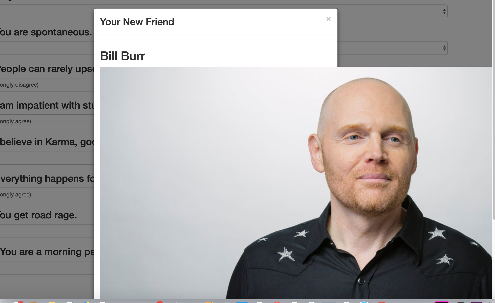

# friendfinder
Objectives
In this activity you will be building a compatibility-based "Friend Finder" application. 

The application will take in results from users' surveys then compare their results against all other users who have completed it. The application will then display the name and picture of the user with the best match overall.

You will use Express to handle routing and will deploy your application on Heroku so others can fill it out.

